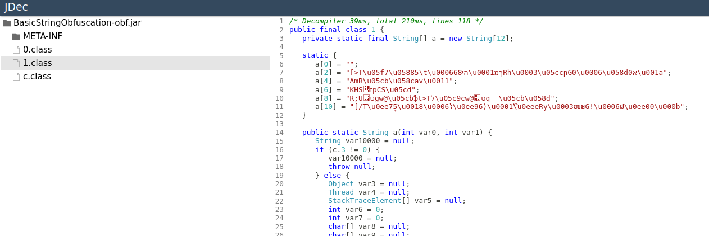
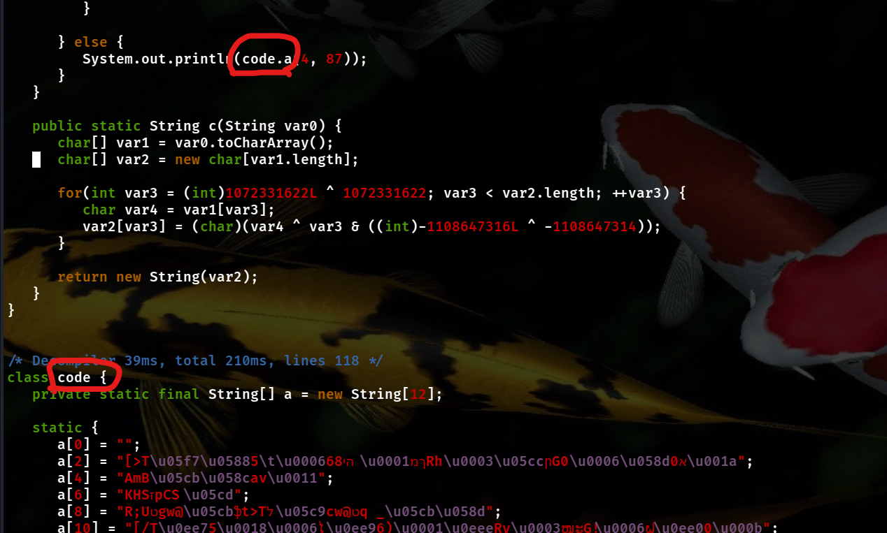
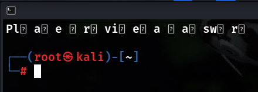
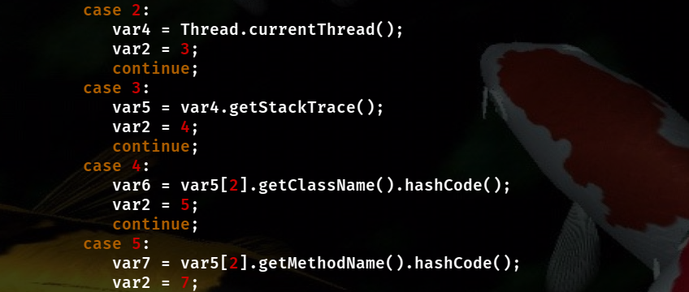
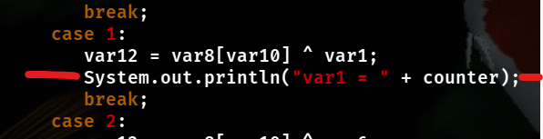
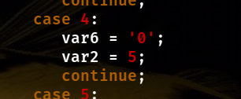
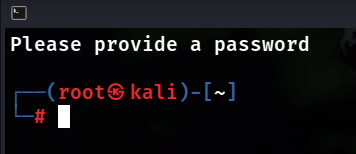
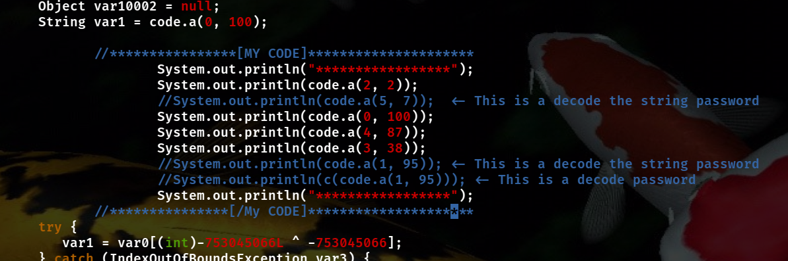
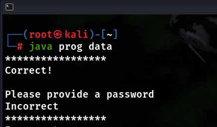

# TryHackMe - JVM Reverse Engineering

[Link to room](https://tryhackme.com/room/jvmreverseengineering)

## Task 6: Advanced String Obfuscation

After a few days with decompilation, in one of the online [decompilers](https://jdec.app/) I managed to get the code clean enough to recompile it.  
I saw a string in the code — I assumed that one of them is an encrypted password.

I copied the code into one file and had to make a few corrections so that it compiles:

1. Rename classes  
2. The `c` class is unnecessary. Change the condition from `c.3 != 0` to `false` in class `1` and it works  
3. Convert calls in code to classes  
4. Delete the line `YourMum var11 = (YourMum)null;` (it was in the default section and is not used)

Now the code compiles and produces output.  
You might notice that the data is being decrypted, but something is wrong.

They are similar to the string displayed in the original program: **"Please provide a password"**.  

At first, I thought the string was decompiled incorrectly or that the compiler was misreading characters.  
After a few hours of trying different encodings like `UTF-8`, `ASCII`, etc., I decided to analyze the decoding functions in detail.

Each character is decrypted with different combinations of inputs.  
It can be concluded that the program uses a hashcode for decryption.  

I wrote a few lines so that the screen shows when and for which character a given decryption combination is called.

It turned out that for unreadable characters, the variable `var6` is always used for decryption.

This makes sense — renaming classes changes their hashcode.  
The original class name was `"0"`, so I found the value assigned to the variable in the code and replaced it with a constant.  
This turned out to be effective.

Now we can simply read the data.  
There is also a `c` function used for the password, and it works correctly.

In the `main` function, we can see the parameters used to call the `a` function.  
We can display them all in one place.

This is the output.  
After removing the comment characters from the code, you will see the flag :)

