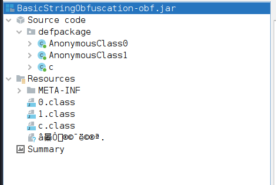
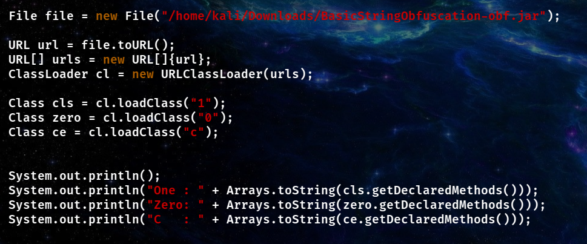
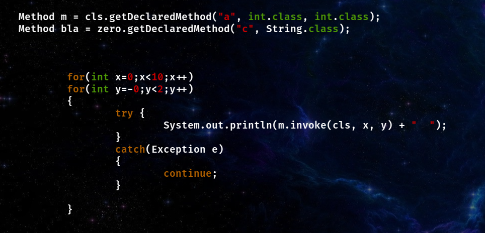
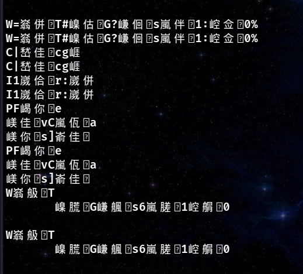
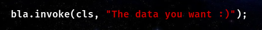
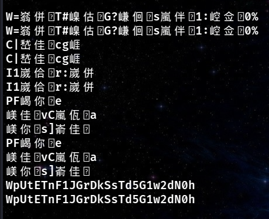
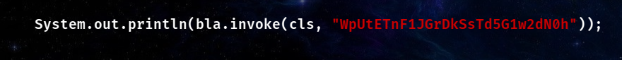
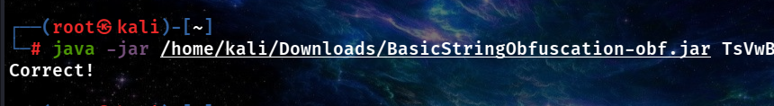

# TryHackMe - JVM Reverse Engineering

[Link to room](https://tryhackme.com/room/jvmreverseengineering)

## Task 7: Extreme Obf

Okay, last assignment in the room. No decompiler that I used was able to decompile the code properly.  

So I had to use dynamic analysis using reflection.  
Using jandex I discovered class names.

First, I wrote code that reads our file and displays the methods used in classes.

After reading the method names, I decided to use a double loop to discover the parameters for which method returns a string.

It turned out that for the first parameter from 0 to 5, the function returns a string, and the rest does not matter.  
I got this output.

I decided to use the functions from class 0 and see what's in the output.

After a few tries, I found out that using the function `0.c` from class 0, it doesn't matter if we put data into the function or not.  
The mere use of the function resulted in the decryption of only one value from the previously discovered data.

I decided to use the data in the `c.0` function and display the output on the screen.

The attempt to use the data in the application ended with success.  
We have a password :)

---

I know the function names are unintuitive, but this is code that I fixed many times trying to get to the solution — it took a really long time.
